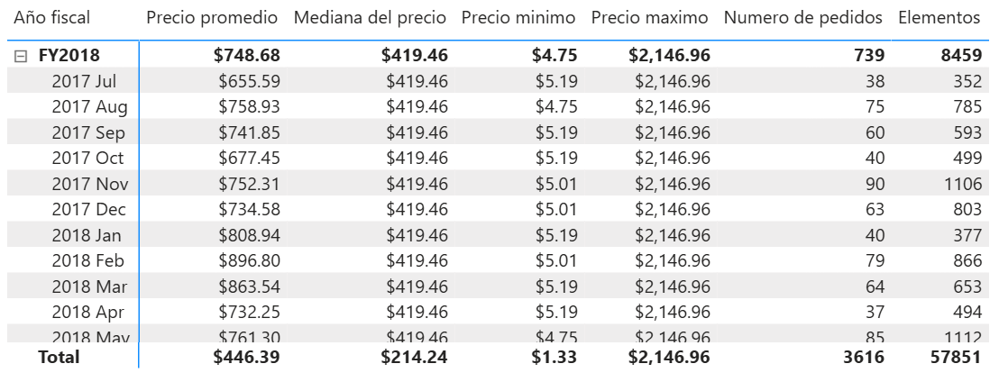

# Laboratorio #1: Ejercicios de prácticas con KPIs

## Planteamiento del ejercicio.

> En este ejercicio se abordaran distintas solicitudes que le piden elaborar como parte del modelado de datos en su organización, para ello le han dado un archivo de Power BI que ya esta previamente modificado para poder realizar las actividades restantes.

## Objetivo

> Ir implementando medidas sobre objetos visuales para ir analizando la información.

## Tiempo estimado

> Dependiendo la experiencia previa que tenga Power BI, puede que algunas de estas actividades las pueda realizar en mas o menos tiempo, pero el tiempo aproximado para analizar y realizar el laboratorio es de aproximadamente 40 minutos.

## Actividades a realizar

> Comienza abriendo el archivo **Modelo-inicial** que se encuentra dentro de la carpeta documentos de la maquina virtual. 

## Creación de medidas básicas

1. Le piden realizar una medida para calcular el beneficio de las ventas. Formatea la medida como una divisa con dos decimales.  
Esta medida será llamada Beneficio.

> Recuerda que la obtención del beneficio se realiza a partir de calcular el total de las ventas y sustraer el total del costo de ventas.

2. Le piden realizar un calculo similar al anterior, pero que en lugar de ver el valor en bruto, quieren ver el valor de forma porcentual. Formatea la medida como un porcentaje con dos decimales.  
Esta medida será %Beneficio

> Recuerda que puedes volver a mandar llamar a otras medidas dentro de nuevas medidas para poder reutilizarlas. Por ejemplo reutilizando la medida de beneficio.

3. Estos valores los iremos mostrando en una matriz que muestre la información de la suma de las ventas, el beneficio y el porcentaje del beneficio por categoría de producto.

> Como referencia podemos usar la siguiente imagen del resultado esperado.

4. Le piden calcular ahora el precio promedio de las ventas. Esta medida la conoceremos como **Precio promedio**.

5. Ahora le piden un conjunto de medidas parecidas a la anterior:
    * **Mediana del precio**.
    * **Precio mínimo**.
    * **Precio máximo**.
    * **Numero de Pedidos**.
    * **Elementos**.

> Pedidos representa el concentrado de la venta englobando los valores de varios productos en dicho pedido, mientras que elementos representa el listado desglosado de cada producto que aparece en un pedido. Recuerda darle formato a cada medida de forma adecuada.

> Como referencia podemos usar la siguiente imagen del resultado esperado.

## Creación de la tabla de fechas

1. Le han comentado que parte de las medidas que necesitará calcular, serán hechas con funciones de Inteligencia de tiempo, pero nota que en el modelo que le han proporcionado no existe una tabla de fechas, por lo que es necesario crearla, considerando que el fin de año fiscal de la empresa para que labora termina en el mes de junio. Esta tabla la llamaremos **Calendario**.

> Recuerda que hay funciones como CALENDAR y CALENDARAUTO que nos servirán para este tipo de situaciones.

2. Le piden agregar a esta tabla recién creada una columna calculada para representar a que año fiscal corresponde cada fecha, es decir que por cada fecha tengamos su respectivo año fiscal usando el formato FY20##. La llamaremos **Año fiscal**.

> Recuerda las funciones de fecha que tiene DAX y que es lo que nos devuelven, también considera que la empresa por la naturaleza de su fin de año fiscal, los meses posteriores a junio representan el siguiente año fiscal, por lo que será necesario una función lógica para devolver un resultado u otro.

3. Ahora le piden otra columna parecida a la anterior pero ahora para el trimestre, usando el formato FY20## TX. La nombraremos **Trimestre** 

> Recuerda que por la configuración del año fiscal, el trimestre enero-marzo seria el tercero, julio-septiembre seria el primero.

4. Le piden otra columna para representar el año y mes que se esta trabajando usando el formato "yyyy MMM". La llamaremos **Mes**.

> Recuerda que dependiendo como queremos trabajar un texto, usaremos funciones DAX de texto.

5. Considera que la columna anterior, por su naturaleza de texto le puede traer problemas al momento de ordenar los resultados de forma cronológica, por lo que decide crear una ultima columna numérica para representar la información anterior.

> Puedes usar la siguiente formula para simplificar este paso. #Mes =
(YEAR('Date'[Date]) * 100) + MONTH('Date'[Date])

6. Establece que la tabla se ordene por esta ultima columna.

7. Genera una jerarquía para ver la información por: Año fiscal, Trimestre y, por ultimo, Mes.

8. Genera las relaciones correspondientes que falten en el modelo.

## Probar los resultados con medidas intermedias.

Para corroborar las medidas y su correcto funcionamiento, nos piden desarrollar medidas para evaluar los KPI, comparando por ejemplo las ventas del vendedor contra su monto objetivo de venta. Pero primero debemos validar como esta funcionando de momento la información.

1. Genera una matriz para incluir la información de los vendedores, las ventas y el Monto objetivo.

Sin aplicar inteligencia de tiempo o alguna expresión de filtro, podríamos pensar que estamos muy por debajo de los objetivos planeados, pero sin contextualizar los datos, no sabemos si es algo reciente o algo que lleva varios meses u años de incumplimiento.

2. Nos comentan los usuarios que no quieren ver información por ejemplo en la sección de total para datos que no sean la suma de ventas, ademas que les interesa usar una medida para reemplazar la columna Monto objetivo. Esta nueva medida se llamara **Objetivo**.

> Puedes usar la función HASONVALUE para corroborar si hay un solo valor para el dato pasado.

3. Ahora nos piden calcular la diferencia entre lo vendido y lo proyectado, a esta medida la llamaremos **Varianza**. Esta medida debe cumplir el mismo criterio que **Objetivo**

4. Por ultimo nos piden calcular la varianza de forma porcentual, por que debemos calcular el resultado de la varianza dividida entre el objetivo. La llamaremos **Margen Varianza**

5. Ahora nos piden una matriz para hacer algunos cálculos basándonos en la inteligencia de tiempo, por lo que agregaremos a la matriz la jerarquía de año fiscal, y la suma de ventas.

6. Para esta primer medida, nos piden hacer el calculo YTD para ver el acumulado de las ventas considerando el fin del año fiscal. La llamaremos **Ventas YTD**. 

> Recuerda que existe la función TOTALYTD donde podemos calcular las ventas del año a la fecha.

7. La siguiente medida será para hacer el seguimiento año a año, donde buscamos comparar el valor del año actual contra el valor del año pasado. La nombraremos como **Comparativa YoY**.

8. Por ultimo devolveremos una medida parecida a la anterior pero usando porcentajes. La denominaremos **Crecimiento YoY**.