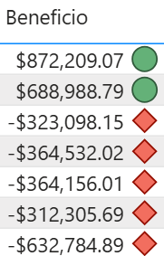
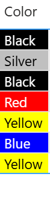
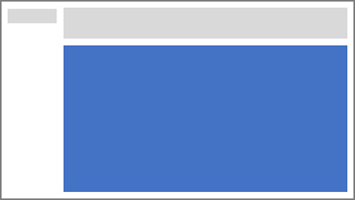

# Laboratorio #1: Creación de un Dashboard

## Planteamiento del ejercicio.

> En este ejercicio se abordaran distintas solicitudes que le piden elaborar como parte del modelado de datos en su organización, para ello le han dado un archivo de Power BI que ya esta previamente modificado para poder realizar las actividades restantes.

## Objetivo

> Ir implementando medidas sobre objetos visuales para ir analizando la información.

## Tiempo estimado

> Dependiendo la experiencia previa que tenga Power BI, puede que algunas de estas actividades las pueda realizar en mas o menos tiempo, pero el tiempo aproximado para analizar y realizar el laboratorio es de aproximadamente 40 minutos.

## Actividades a realizar

## Mejorar el reporte

En el curso pasado, diseñaste y publicaste un reporte, en esta ocasión modificaras dicho reporte para añadir detalles avanzados sobre el mismo.

1. Abre el archivo **Modelo-desarrollado** que se encuentra dentro de la carpeta documentos de la maquina virtual.

2. Genera una nueva pagina, y renombra la como **Detalles del producto**, oculta dicha pagina pues será usada como una pagina de obtener detalles.

3. El criterio para profundizar la investigación será con base a la categoría de producto, por lo que añade esta columna a la **sección obtención de detalles**.

> Recuerda que este apartado lo puedes encontrar en el panel de visualizaciones en la parte inferior del mismo.

4. Prueba a marcar una categoría en la sección de obtención de detalles, por ejemplos Bikes.

5. Añade un objeto visual de tarjeta usando el dato de la categoría del producto, posiciona la en la parte superior, toma de referencia la siguiente imagen para ubicar la dentro de la pagina.

6. No es necesario mantener la etiqueta de la categoría, por lo que desmarca esta opción de la tarjeta. Establece el color de fondo con un color gris claro.

7. Ahora inserta una tabla usando los siguientes datos:   
    * Subcategoria del producto.
    * Color del producto.
    * Cantidad de ventas.
    * Ventas.
    * Beneficio.

> Toma de referencia la siguiente imagen para posicionar la en la hoja del informe.

8. Ahora nos piden que con base a beneficio, se aplique formato condicional, si el beneficio es negativo, agrega un icono a la derecha del mismo de color rojo, si es positivo agrega un icono de color verde.

> Recuerda que puedes desplegar opciones adicionales para los datos de la tabla haciendo clic en la flecha de los mismos.

> Puedes tomar de referencia la siguiente imagen.

9. Ahora nos piden aplicar formato condicional para aplicar tanto el color de fondo y de fuente, basándonos en los valores de las columnas de **Color fondo** y **Color fuente** aplica este formato condicional sobre la columna Color del objeto visual que estamos trabajando.

> Toma de referencia la siguiente imagen.

## Agregando marcadores.

1. En la pagina Mi desempeño selecciona Marcadores dentro de la cinta de opciones.

2. También selecciona la opción de selección dentro de la cinta de opciones.

3. Usando estos dos paneles, oculta uno de los objetos visuales y genera un marcador, repite este proceso alternando cual objeto visual queda visible en cada marcador.

4. Renombra los dependiendo que contenido se ve si son **Columnas** o **Barras**.

5. Por ultimo edita ambos marcadores para que no capturen los datos, y que puedan irse actualizando dependiendo los filtros que se están aplicando en la pagina.

6. Ajusta las visualizaciones para que ocupen el mismo ancho del objeto visual tarjeta, y ocupe el resto del alto de la pagina.

> Toma de referencia la siguiente imagen.

7. Inserta dos botones que respectivamente permitan seleccionar a cual marcador le daremos protagonismo mostrando su información. Estos posiciona los por debajo del segmentador que ya teníamos.

8. Por ultimo genera 3 nuevas paginas, estas paginas representaran un condensado por grupo(continente), llama a estas paginas como: **America**, **Europa** y **Pacifico**.

9. Oculta estas nuevas paginas recién creadas, en la pagina **Beneficio**, copia y pega la tabla que está en dicha pagina y pegala en cada una de las nuevas paginas.

10. En el panel de filtros agrega un filtro a nivel de pagina para solamente ver la información de dicho grupo.

11. Dentro de cada pagina agrega un botón que te permita ir a la pagina **Beneficio**.

12. En la pagina **Beneficio** ahora agrega los botones correspondientes para ir a cada una de las paginas anteriormente mencionadas.

13. Puedes ir agregando algunos graficos dentro de estas paginas, como por ejemplo un medidor para evaluar las ventas realizadas con el objetivo o distintos tipos de tarjetas para mostrar la información que resuma el contexto de este territorio, esta parte queda libre a tu imaginación para personalizarlo, pero considera almenos unos 3 o 4 elementos adicionales por pagina, al final dentro de estas paginas deberá estar el botón de navegación, la tabla que copiamos y pegamos en un paso anterior y al menos los 3 elementos adicionales que agregaste.

## Publicación

1. Devuelta a la pagina Overview, selecciona el Año fiscal 2020.

2. Corrobora que no hay regiones seleccionadas en el segmentador.

3. En la cinta de opciones publica este reporte a tu area de trabajo.

> Recuerda que para publicar el reporte debes iniciar sesión con una cuenta que tenga acceso al servicio de Power BI, por lo que utiliza el acceso que se te proporciono para iniciar sesión y poder publicar tu reporte.

4. Una vez publicado el reporte abre en el navegador la pagina del servicio de Power BI.

5. Prueba la navegación dentro del servicio de Power BI al ver y explorar el informe que acabas de subir.